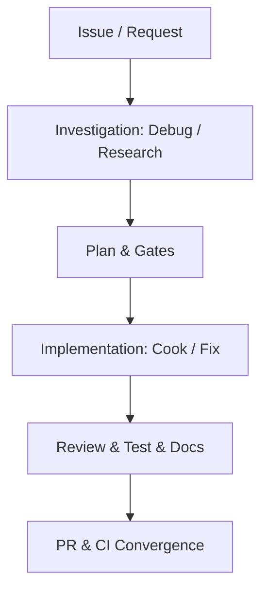
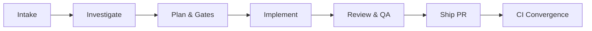

# Report and Issue Templates

Templates for GitHub issues and completion reports used by the vibe pipeline.

## GitHub Issue Body

Use this body when creating a new issue or updating an execution tracking section:

~~~markdown
## Outcome
<user-visible outcome>

## How It Works
- <operational bullet 1: core mechanism and entry point>
- <operational bullet 2: key components and data flow>
- <operational bullet 3: integration boundaries and safeguards>

## Architecture / Flow

## Advisor Scope Lock (only when --advice)
- Locked Scope: `<boundaries confirmed by kongming advisory review>`
- Explicit Non-Goals: `<rejected scope creep or out-of-scope items>`

## Implementation
- Branch: `<branch-name>`
- Plan: `<relative/path/to/plan.md>`
- Mode: `<official|beta|both>`
- Route: `<feature|bugfix>`
- PR: `<url once created>`
- Stable PR: `<url once created, only when --both>`

## Acceptance Criteria
- [ ] <criterion from plan>

## Pipeline State
- [x] Worktree and branch created or reused
- [x] Pre-plan investigation (debug/research if applicable)
- [x] TDD plan created or existing plan reused
- [x] Plan validated and red-teamed
- [x] Issue labeled `in progress` before implementation
- [ ] Implementation complete
- [ ] Local review passed
- [ ] Test audit / optimization complete (if applicable)
- [ ] Docs updated or follow-up issue filed (if applicable)
- [ ] PR reviewed and fixed
- [ ] Merged and CI green (only when --ship)
- [ ] Beta merged and beta CI green (only when --both)
- [ ] Stable merged and stable CI green (only when --both)
~~~

## Completion Report

Emit this report at the end of the vibe pipeline run:

~~~markdown
**Vibe Result**
- Source: <issue/request>
- Branch/worktree: <branch> | <path>
- Plan: <relative path>
- Issue: <url>
- PR: <url> (beta-stage PR when --both)
- Stable PR: <url|n/a> (only when --both)
- Mode: official|beta|both
- Route: feature|bugfix
- Review: <approve/request-changes/comment + fix iterations>
- Merge: skipped|merged|blocked (per stage when --both)
- CI: green|failed|blocked (per stage when --both)
- Research: run (<topics>) | skipped (<reason>)
- Debug: run (root cause proven) | skipped (<reason>)
- Test: create|audit|optimize (
) | skipped (<reason>)
- Docs: updated in-repo | external issue filed (<url>) | skipped (<reason>)

### Journey Diagram

### Implementation Summary
- <concrete summary of changes shipped across components>

### Plan Deviations
- <deviations from initial plan with rationale, or "None">

### Subagent Quality Assessment
- Review Verdict: <Approved | Changes Applied>
- Findings Breakdown: <0 Critical / 0 Important / N Minor — resolved X/Y>
- Evaluator Notes: 

### Human Next Steps
- [ ] <concrete follow-up verification, deployment canary check, or next roadmap task>

Unresolved questions:
- None
~~~
