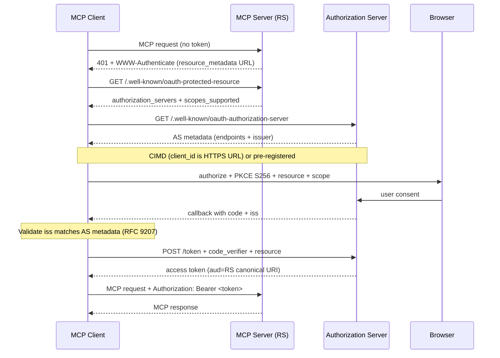

# OAuth 2.1 for MCP over Streamable HTTP

<!-- cruft-lint-allow: RFC 2119 keywords quoted from the specification, not local emphasis -->

Use this OAuth recipe only for a selected authenticated remote MCP target. Verify the negotiated protocol, client, SDK and authorization-server support before applying discovery or registration extensions. Retain PKCE, issuer/audience and scope validation appropriate to that flow. stdio uses the credential-resolution chain instead.

**Sources:** [MCP Authorization Spec](https://modelcontextprotocol.io/specification/), [RFC 9728 (PRM)](https://datatracker.ietf.org/doc/html/rfc9728), [RFC 8707 (Resource Indicators)](https://www.rfc-editor.org/rfc/rfc8707.html), [RFC 9207 (Issuer ID)](https://datatracker.ietf.org/doc/html/rfc9207), [OAuth 2.1 draft](https://datatracker.ietf.org/doc/html/draft-ietf-oauth-v2-1-13)

## End-to-end flow

1. Client calls MCP without a token → server returns `401` with `WWW-Authenticate` pointing at `resource_metadata`.
2. Client GETs RFC 9728 Protected Resource Metadata (`/.well-known/oauth-protected-resource`) → discovers `authorization_servers` and `scopes_supported`.
3. Client GETs RFC 8414 Authorization Server metadata (`/.well-known/oauth-authorization-server`) or OIDC discovery.
4. **Client Registration** (select a supported method):
   - **CIMD when supported:** Client uses an HTTPS URL as its `client_id` ([Client ID Metadata Documents](https://datatracker.ietf.org/doc/html/draft-ietf-oauth-client-id-metadata-document-00)). The AS fetches metadata directly from that URL.
   - **Fallback:** Pre-registered client_id or DCR where supported by the chosen protocol/client.
5. Client generates PKCE S256 `code_verifier` / `code_challenge`, opens browser authorize URL with canonical `resource=<MCP_URI>` (without trailing slash) and requested `scope`.
6. User consents → redirect to client callback with authorization `code` and `iss`.
7. **RFC 9207 Issuer Validation:** Client MUST validate that `iss` strictly matches the recorded AS issuer from step 3 before sending the authorization code to any token endpoint.
8. Client requests token from AS with `code_verifier` + `resource` → AS issues RFC 8707 resource-bound access token.
9. Client calls MCP with `Authorization: Bearer <token>`; server validates signature, audience (`aud == resource`), and scopes.



## Security Best Practices

- **Canonical Server URI (RFC 8707)** — Client MUST send `resource` on authorize and token requests. Use lowercase scheme and host without trailing slash (e.g. `https://mcp.example.com/mcp`). RS MUST reject tokens not matching its canonical URI.
- **Strict `iss` Validation (RFC 9207)** — Prevents mix-up attacks. Reject any callback where `iss` differs from the authorization server issuer discovered in step 3.
- **Client ID Metadata Documents (CIMD)** — Optional registration model when the authorization server and client support it.
- **Header-only tokens** — Access tokens MUST be sent via `Authorization: Bearer <token>`. Never accept or emit tokens in URI query strings.
- **No token passthrough** — Never forward client access tokens to downstream internal APIs; mint distinct upstream tokens.

## AI-tool integration matrix

| Client                     | Configuration / Command                                                                                                    |
| -------------------------- | -------------------------------------------------------------------------------------------------------------------------- |
| **ChatGPT / OpenAI Codex** | Codex/ChatGPT Plugin manifest or `codex mcp add <name> --url https://mcp.example.com/mcp` then `codex mcp login <name>`    |
| **Claude Code**            | `claude mcp add --transport http <name> https://mcp.example.com/mcp` — browser OAuth flow on first launch                  |
| **Claude Desktop**         | Settings → Developer → Connectors → Add Custom Connector → MCP URL; completes browser OAuth 2.1                            |
| **Cursor**                 | `.cursor/mcp.json`: `{ "mcpServers": { "name": { "url": "https://mcp.example.com/mcp" } } }` — triggers CIMD/browser OAuth |
| **VS Code**                | Workspace / user settings with `"type": "http"`, `"url": "https://mcp.example.com/mcp"`                                    |

## Cloudflare Zero Trust + workers-oauth-provider

Host the protected resource server on Cloudflare Workers with managed OAuth:

```ts
import { OAuthProvider } from '@cloudflare/workers-oauth-provider';

export default new OAuthProvider({
  apiRoute: '/mcp',
  apiHandler: MyMcpWorker,
  defaultHandler: MyAuthUi,
  authorizeEndpoint: '/oauth/authorize',
  tokenEndpoint: '/oauth/token',
  clientRegistrationEndpoint: '/oauth/register', // optional legacy DCR fallback only; CIMD preferred
});
```

For the Cloudflare preset, verify the selected Access/provider integration exposes the required discovery and resource metadata; do not assume this from its name.

## Authorization-server selection

Reuse the selected provider and verify its current protocol extensions, account
limits and pricing from official evidence. Do not infer CIMD/metadata support or
free-tier entitlement from a provider name. Validate the actual OAuth flow end to
end and include denial, issuer/audience mismatch and secret-redaction checks.

## Related

- `mcp-transports.md` — Streamable HTTP transport implementation
- `auth-resolution-chain.md` — CLI & stdio credential chain (env/flags)
