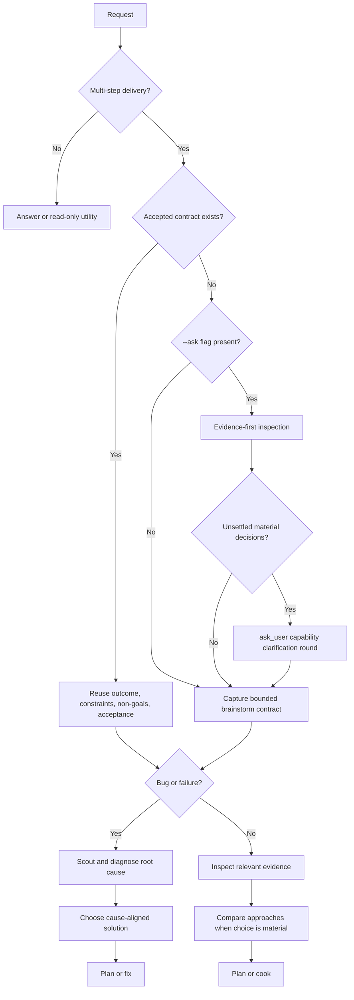

# Brainstorm

Turn incomplete intent into a bounded delivery contract. Stay honest about
evidence, trade-offs, and uncertainty without turning a clear request into a
ceremonial interview.

## Brainstorm contract

Every multi-step product, code, documentation, or maintainer delivery starts by
capturing:

- **Outcome:** the user-visible or operational end state.
- **Constraints:** safety, compatibility, time, technology, and ownership
  boundaries that shape the work.
- **Non-goals:** nearby work that this delivery will not absorb.
- **Acceptance criteria:** observable evidence that will prove completion.

### Conditional contract fields

In addition to the four required fields, capture these conditional fields when their triggering conditions hold:

- **Trade-offs:** required whenever option exploration ran (≥2 viable approaches). For each compared approach, name the assumption it depends on most and the condition under which it fails first.
- **Better approaches:** required when inspection surfaced an approach superior to the one the user proposed or implied. State concrete evidence, operational delta, and cost of switching.

**Conditional rendering rules:**

- Omit the heading entirely when the condition does not hold. Never emit `Trade-offs: N/A` or empty placeholder bullets.
- When option exploration ran and no better approach was found, record: `Better approaches: none — recommended direction is the requested one (<evidence>)`. Silence otherwise cannot be distinguished from failing to evaluate alternatives.

An accepted design or plan satisfies the opening gate when it already contains
these fields. Reuse it and identify only material gaps; do not make the user
repeat settled decisions.

## Proportional behavior

- For a concrete request, summarize the four fields briefly and continue.
- Ask a concise question only when a missing answer would materially change the
  result, safety boundary, or public contract and cannot be discovered.
- Explicit autonomous execution may continue once the four fields are concrete;
  it does not require a routine approval pause.
- Direct answers and low-level read-only utilities do not require a design loop.
  If investigation turns into workspace mutation or delivery, satisfy the gate
  before that boundary.
- Separate target intent from current evidence. Inspect relevant repository or
  live state before claiming an approach is feasible.
- Separate uncertainty that can be discovered from uncertainty that cannot. Most
  unknowns are resolvable by reading source, docs, tests, or live state — resolve
  those instead of hedging against them. Reserve robustness reasoning for what
  stays unknowable at decision time, such as future requirements, third-party
  behavior, or audience response.

## Bug routing

For bugs, start by framing the expected repaired behavior, constraints,
non-goals, and acceptance evidence. Do not propose fixes from the symptom.

1. Scout the affected path and capture the failing state.
2. Diagnose and prove the root cause.
3. Compare cause-aligned solutions only after diagnosis.
4. Use a full options discussion when multiple viable fixes or an architecture
   decision remain; otherwise record why the direct fix is sufficient.

This preserves brainstorm-first intent without allowing brainstorming to replace
root-cause analysis.

## Option exploration

When the work has a real design choice:

1. Inspect the smallest relevant source, docs, tests, and current plans.
2. State the confirmed constraints and any evidence gaps.
3. Present up to three viable approaches with meaningful trade-offs. For each,
   name the assumption it depends on most and the condition under which it fails
   first. Compare approaches on their worst plausible case, not only their best.
4. Recommend the smallest approach that satisfies the contract. When a
   load-bearing assumption cannot be resolved now, prefer the approach that is
   cheapest to abandon.
5. Resolve material disagreement before implementation begins.

Challenge assumptions with evidence. Apply KISS and DRY. Deliver the full
requested scope — never trim or defer what the user explicitly asked for. Do not
invent extra components, migrations, or governance to make a design look
complete. With `--yagni`, additionally challenge and cut any scope not needed for
the stated outcome.

## Flags (parse once before loading)

| Flag                                                         | Selective reference / behavior                                           |
| ------------------------------------------------------------ | ------------------------------------------------------------------------ |
| `--ask`                                                      | `references/interview-mode.md`; interview once, never forward this flag  |
| `--html`                                                     | `references/html-output-mode.md`; additional HTML brief                  |
| `--report`                                                   | `references/report-output-mode.md`; durable Markdown, composes with HTML |
| `--advice`                                                   | `references/advice-mode.md`; explicit supervisor checkpoints             |
| `--ultra`                                                    | `references/brainstorm-ultra-mode.md`; five candidates and verifier      |
| `--yagni`                                                    | Scope-cutting opt-in; forward downstream                                 |
| `--no-antv`, `--no-diagram-design`, `--no-editorial-visuals` | HTML visual-layer switches; retain in HTML route                         |

All flags compose as their selected reference specifies. Reuse settled contract fields.

## Authoritative flow

When `--ask` is present and unsettled material decisions remain after evidence inspection, the clarification round runs before the brainstorm contract is finalized, aligning user intent with discovered repository reality. If an accepted contract already settles requirements, reuse it directly without redundant questioning.

## Handoff

Pass the contract fields, including Trade-offs and Better approaches when present, chosen direction, evidence, and unresolved risks
to the next owning workflow:

- feature or documentation delivery: the installed plan skill, then `/ak:cook`;
- diagnosed bug: `/ak:fix`;
- exploration only: report the recommendation and stop.

If the user passed `--yagni`, include the literal flag in every downstream skill
or subagent handoff. Otherwise, do not introduce it during handoff.
Unlike `--yagni`, do not carry `--ask` forward into downstream workflows; interview mode applies only to the opening brainstorm session when explicitly invoked.

Write a durable summary only when the decision must survive the session or feed
a plan. Use the repository's configured report location and naming convention;
do not create a report merely to satisfy the gate.

## Boundaries

- This skill shapes intent and choices; it does not implement the solution.
- Never claim current behavior from intent alone.
- Never expose secrets or unrelated private files during inspection.
- List unresolved questions last when any remain.

## Workflow position

**Typically precedes:** `ak-plan`, `/ak:cook`.

**Bug path:** opening intent frame -> scout and debug -> solution brainstorm when
needed -> `/ak:fix`.
